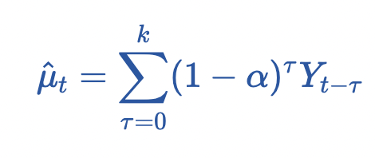
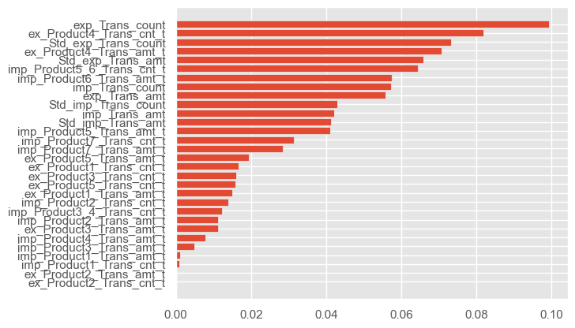

# **Usage of transaction data to predict credit event**

## Team Member

Student Name | Student ID
:---------  | ---------
Zhang Yuyang| 2301212424
Ge Ruiyang| 2301212326

## Project Introduction

This is a project about using transaction data to predict defaults. In this project, we use several machine learning methods to predict default events based on the transaction data provided by HSBC.

It should be noticed that the dataset is imbalanced (e.g., approximately 99% of the data is non-default data and only 1% of the data is default data), so our priority is to identify the majority of companies that are likely to default to recommend an additional screening, so recall should be our metric of choice rather than accuracy.What's more, There is not much valid information in this dataset, and there are many missing and error values, so caution is required when dealing with features. I will describe it in detail below:

- The first and most important point is that we are dealing with default related forecasts. Due to the serious imbalance of default data, we use the **oversampling** method to achieve better results. In addition, in this dataset, we focus more on Recall because we want to predict as many customers as possible who are likely to default, not just improve the accuracy of our own predictions.

- Due to the sparsity of transaction data, we spend a lot of effort on data cleaning and processing. As the project progressed, we found that it might be better to focus more on **feature engineering** rather than just optimizing Recall, because there seemed to be a lot to explore in the data. Default forecasting using transaction data is largely feature-oriented. We construct and screen many useful features from the perspectives of classification summation, time weighting, difference and volatility. In the end, we got a better result.

- To our delight, after optimizing the feature engineering part, **we improved the Recall to more than 90%**. We know in class that 90% is not good for extremely lopsided data that actually has around 99% positives, but considering that we need to make a prediction with less than 40 actual positives, it's actually relatively good.

## Data Cleaning and Processing

First, let's focus on the data. In the dataset, we are able to obtain the amount and count of the import and export transactions. It is worth noting that the transaction data has two time indexes "COHORT_MONTH" and "IMAGE_DT", where each "COHORT_MONTH" is June 30 of a certain year which further contains the transaction information of the company in the past 12 months, and under each "COHORT_MONTH" records whether the company defaults or not (e.g. 0 or 1). On June 30th of every month, we need to predict whether the company will default or not based on data from the previous 12 months.

    

  

* Import & export transaction data

    

  

* Target (credit event)

    

  

### 1. Handling of outliers and missing values

* The values in the count column of the transaction data will appear negative, and after verification, these negative values appear on the date that no transaction occurred, so we change them to 0.

* Another problem of the dataset is that, the count of some import and export transaction data is missing where there is transaction amount in the corresponding position, we change the corresponding count to 1.

    

  

    

  

### 2. Time weighting: ewm

    

  

The transaction data has two time indexes "COHORT_MONTH" and "IMAGE_DT", where each "COHORT_MONTH" is June 30 of a certain year which further contains the transaction information of the company in the past 12 months. Under each "COHORT_MONTH" we record whether the company defaults or not (e.g. 0 or 1). Thus based on the different IMAGE_DT dates of the same COHORT_MONTH, we took into account how long they were from COHORT_MONTH and tried to construct meaningful factors. Specifically, we assign weights according to the length of time IMAGE_DT is from COHORT_MONTH, and the closer the date is to COHORT_MONTH, the greater the weight.

    

  

### 3. Aggregate data by category

Considering the limitations of the features of the original data,  for all IMAGE_DT data of each company and each COHORT_MONTH, we sum import_Product_Trans_amt_t, export_Product_Trans_amt_t, import_Product_Trans_cnt_t, export_Product_Trans_cnt_t respectively and take them into account as new factors.

    

  

## Descriptive Statistics and Correlation Analysis

* After data processing, we once again emphasize that this data is seriously imbalance. As we can see from the graph of the kernel function, basically all the data is piled up at 0.

    

  

    

  

* In addition, we have done correlation analysis and made heat maps.

    

  

## Division of Training & Test Set and Feature Selection

* In this section, we split the data set into training samples (75%) and test samples (25%).
* Do the standardization.
* Due to the imbalance of the data, we apply the technique of oversampling, which replicates the samples of the minority classes to increase their number, so as to balance the proportion of classes in the dataset.
* Then we use random forest method for feature selection.

    

  

## Construction and training of different classification models

In this part, we use logistic regression, SVM, decision tree, random forest to build models and train.

Originally, our Recall was only around 80%:

    

  

After improvement and optimization, Recall was increased to more than 90%, and RUC also made great progress:

    

  

    

  

* We also trained the LSTM model and obtain the loss and confusion matrix.

    

  

## Future outlook

In this Project, we cleaned and constructed the characteristics of the transaction default data. On this basis, we used five kinds of machine learning models for predictive analysis, and obtained a Recall of more than 90%. We know that this value still needs to be increased, which can be considered from the following aspects:

1. Mining more and more effective factors and features based on fundamentals or timing perspectives, despite the strong limitations and many missing values of transaction data.

2. Increase the data amount of default information, or make more attempts from the perspective of oversampling.

3. Add additional trading information. Transaction data alone may not provide a full extraction of default information, as incidental decisions are mixed in with default decisions.
